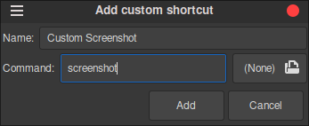
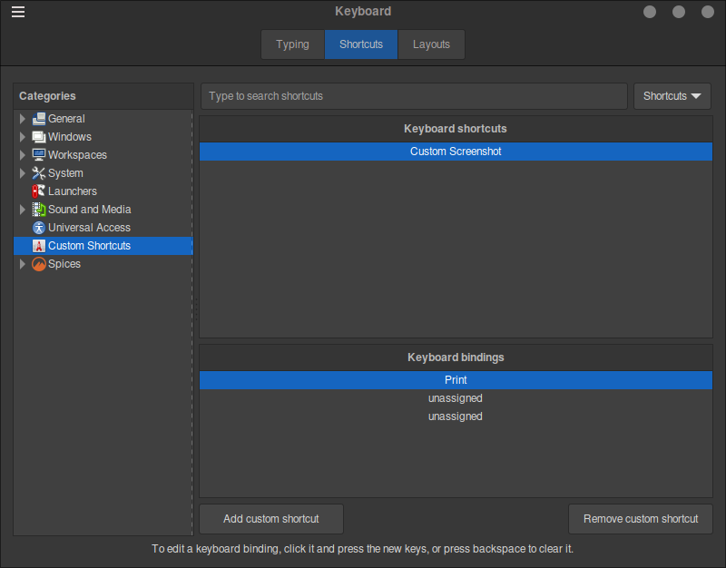

# Easy Screengrab

I vibe coded this, but it works surprisingly well.

## 🛠️ Build
`g++ screenshot.cpp -o screenshot -lX11 -lXext -lXrender`

## 📦 Install
`sudo mv screenshot /usr/local/bin/screenshot`

## 🚀 Run
`screenshot` - Test the command in the terminal

Once you have the screenshot command working, use "Custom Shortcuts" to run the command whenever you press whatever your prefered hotkey is. (If you use PrintScreen, like I do, Make sure no other OS screenshot utilities are bound to that key)

**Example:**

